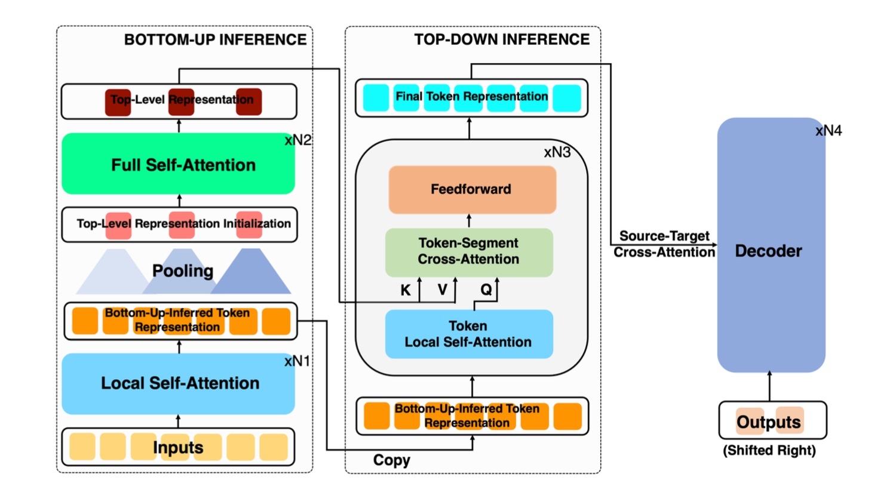
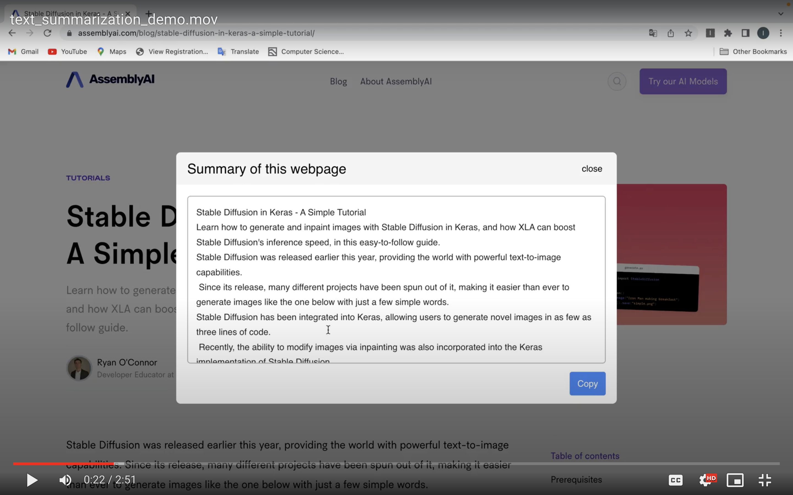

# Text summarization project

This repo contains the code and trained models for my text summarization project

## Quick Links

- [Overview](#overview)
- [How to Run my model](#how-to-run-my-model)
  -  [Hyper-parameter Setting](#hyper-parameter-setting)
  -  [Train or Finetuning](#train-or-finetuning)
  -  [Evaluate](#evaluate)
  -  [Use](#use)
  - [Results and outputs](#results-and-outputs)
  - [Future Plans](#future-plans)
- [Chrome extension](#chrome-extension)

## Overview

This project contains two parts. In the first part, I tried to implement the model described in the paper Long Document Summarization With Top-Down And Bottom-up Inference(https://doi.org/10.48550/arXiv.2203.07586) This model is specialized for long document summarization and currently has the highest score at the arXiv and Pubmed dataset and performs well on long document summarization, but the original paper didn't share their code.

Like in the paper, my model is also based on Bart(it also works with Pegasus and T5). For local self attention(sliding-window attention), I am using the implementation of sliding-window attention from Longformer(Huggingface). For full self attention and cross attention, I am using the attention of Bart. 

 

 

In the second part, I (will) make a chrome extension with backend that can summariza the whole webpage. Currently, since my model needs more training to be satisfying, I am using Pysummarization at the backend for now.

## How to run my model

Currently, everything is still on the Python Notebook. You can refer to the guide on TDBU-Bart.ipynb on how to train, finetuning, evaluate and use it. Later I will move things to Python and make it easier to use.

### Hyper Parameter Setting
(to be updated)
### Train or Finetuning
(to be updated)
### Evaluate
(to be updated)
### Use
(to be updated)
## Results and Outputs

Since I have changed the encoder part of Bart entirely, I cannot use from_pretrained to speedup training, and have to do the training from scratch. I trained my model on first 5% of CNNDM dataset for testing; for training setting, I used 3 epochs, with learning rate of 2e-5, weight decay of 0.01, and I used batch size of 4 since I do not have enough GPU memory. For the model, I am using a smaller model compared to in the paper, also because of GPU memory and training time. In the bottom up part, I used 4 local self attention layers, and 4 full self attentions after the pooling layer, and in the top down part, I used 4 layers as they did in the paper. 

The following are ROUGE scores calcualted by the standard ROUGE Perl package. 

#### CNNDM
|                   | ROUGE-1 | ROUGE-2 | ROUGE-L |
|-------------------|---------|---------|---------|
| BART-pretrained   | 13.64   | 1.86    | 10.95   |
| TDBU-local-attn-1(halfway) | 12.12   | 8.18   | 10.2   |
| TDBU-local-attn-2 | 12.56   | 1.06    | 9.92    |

# Chrome Extension

I build a chrome extension to help people summarize the webpage easy and quickly. It is very easy to use. After opening any webpage, just right click "summarize this webpage" in the popup menu, and you will see the summarization.

 

 
Here is a demo of how to use the extension: https://drive.google.com/drive/folders/1sxSjAuTSqMyjwJgMtFdMG6rfrCvmXOK3?usp=sharing
